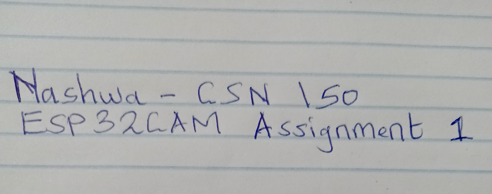

# Cybersecurity : CSN150-Doc-Template

## Name of Project
ESP32CAM Camera Setup + Arduino Blink Sketch

## Purpose
This lab report includes documentation for two hands-on assignments:
1. Simulated setup of the ESP32CAM camera firmware.
2. Arduino setup and simulation of the Blink Sketch on ESP32.

Since I do not currently have access to the ESP32CAM hardware or FTDI programmer, the steps are documented as a simulation following official instructions. A placeholder image is submitted as a substitute for the live camera shot.

---

# Assignment 1: ESP32CAM Camera Setup

## Name
Nashwa Saleh – CSN 150

## Documentation Followed
- https://lastminuteengineers.com/getting-started-with-esp32-cam/

Although I didn’t have the ESP32CAM module or FTDI programmer, I followed the tutorial steps to simulate the firmware setup process.

## Objective
To simulate the process of flashing the camera firmware onto an ESP32CAM module using the Arduino IDE, and visualize the result using a placeholder image in lieu of an actual camera output.

## Equipment (Simulated)
- ESP32CAM (not available)
- FTDI programmer (not available)
- Arduino IDE (installed)
- Laptop and GitHub for documentation
- Handwritten name image as camera output

## Steps I Followed
1. Installed Arduino IDE from the official site: https://www.arduino.cc/en/software
2. Opened `Preferences` and added this URL to "Additional Board Manager URLs":

https://raw.githubusercontent.com/espressif/arduino-esp32/gh-pages/package_esp32_index.json

3. Opened Tools → Board Manager and installed “ESP32 by Espressif Systems”.
4. Selected board: `AI Thinker ESP32-CAM` under Tools → Board.
5. Loaded the example sketch:

**File → Examples → ESP32 → Camera → CameraWebServer**

6. Simulated connecting ESP32CAM to FTDI programmer and uploading code.
7. Expected output: Serial Monitor displays IP address for web stream (e.g., http://192.168.1.20/)

## Problems
The absence of physical hardware meant I couldn’t verify camera output. To meet assignment criteria, I submitted a handwritten name photo to represent the camera view.

## Final Output (Simulated)
A placeholder image of my name and class number was used to simulate the ESP32CAM pointing at myself:



---

# Assignment 2: ESP32 Setup + Blink Sketch

## Documentation Followed
- https://lastminuteengineers.com/esp32-arduino-ide-tutorial/

This assignment demonstrates setup of ESP32 with Arduino IDE and execution of a basic Blink sketch. It simulates the blinking behaviour using pseudocode and explanation.

## Objective
Set up the ESP32 environment in Arduino IDE and simulate the LED blink sketch. Explain how to control the blink speed by modifying delay values.

## Steps I Followed
1. Installed the Arduino IDE.
2. Added the following URL to Arduino Preferences:

3. Installed the ESP32 board package via Tools → Board Manager.
4. Selected the ESP32 Dev Module board (in simulation).
5. Opened `File → Examples → 01.Basics → Blink`
6. Edited the Blink sketch to simulate faster and slower blinking.

## Code Explanation (Simulation)

```cpp
// Standard Blink Sketch
void setup() {
pinMode(LED_BUILTIN, OUTPUT);  // Initialize digital pin as an output
}

void loop() {
digitalWrite(LED_BUILTIN, HIGH);  // Turn LED on
delay(1000);                      // Wait 1 second
digitalWrite(LED_BUILTIN, LOW);   // Turn LED off
delay(1000);                      // Wait 1 second
}
